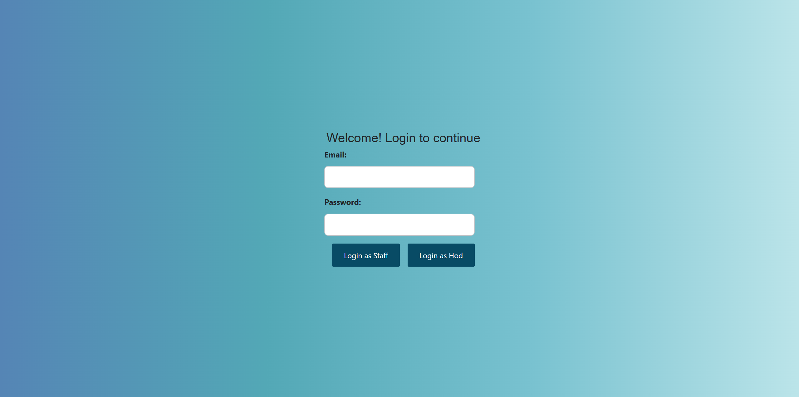
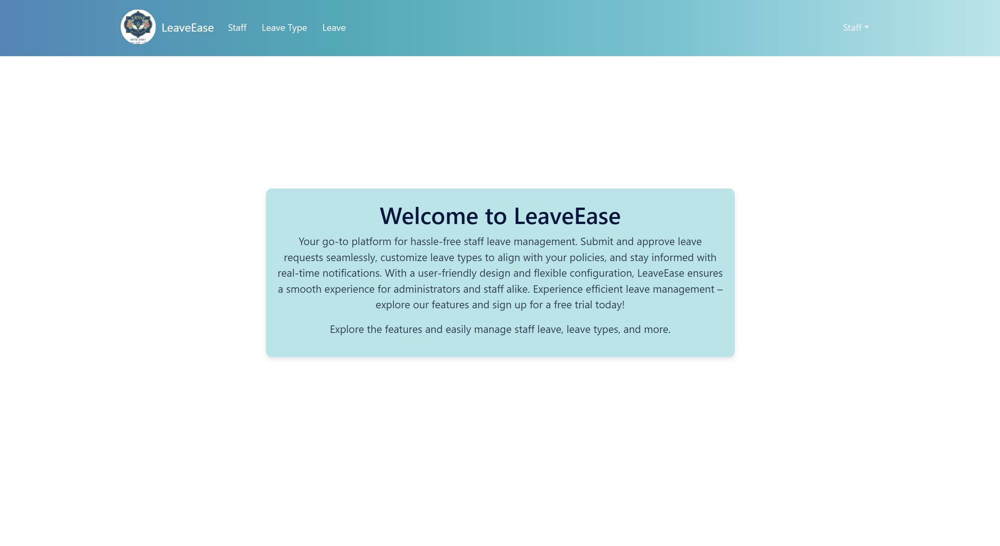
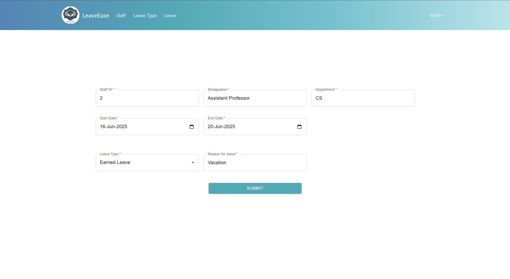
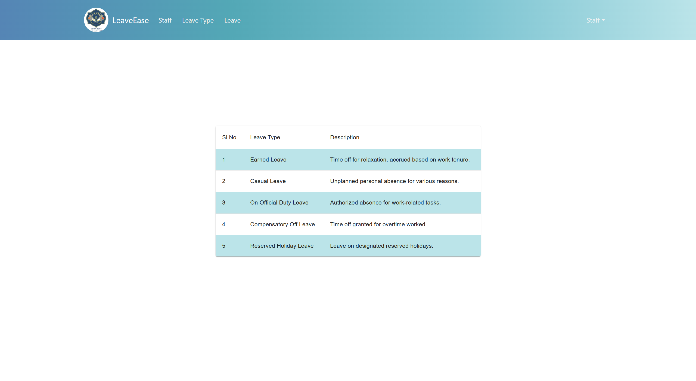
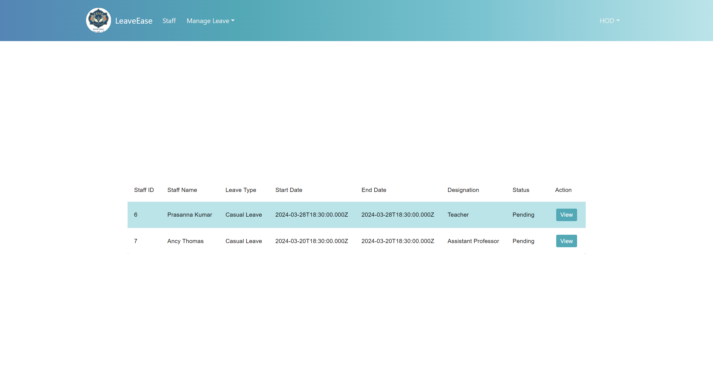
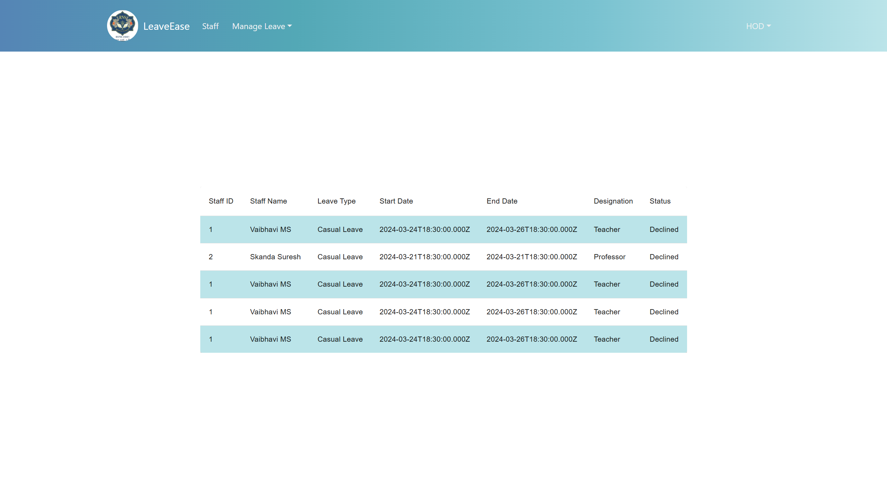
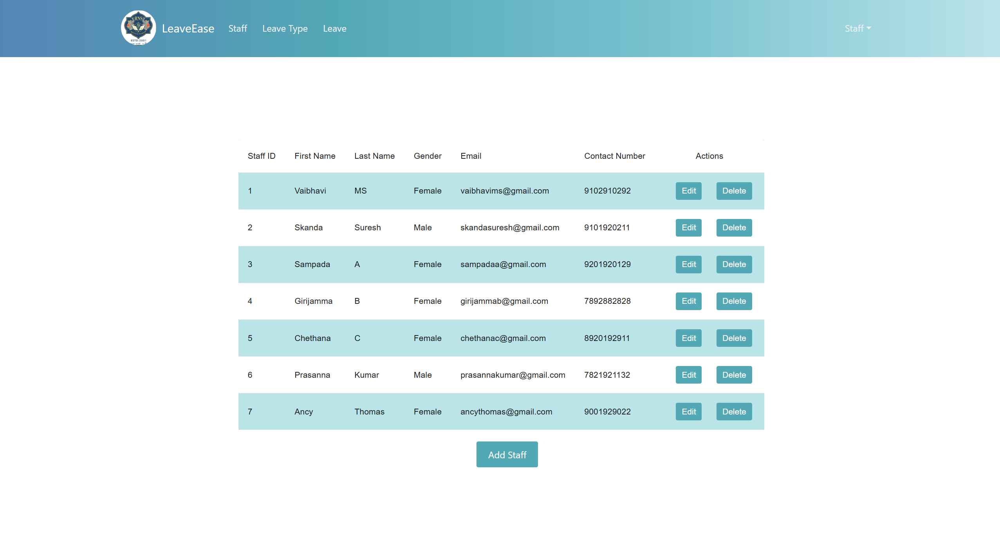

# 🏢 Staff Leave Management System

> A full-stack web application built to streamline leave requests, approvals, and management for staff members in a department. It features a responsive ReactJS frontend, a robust NodeJS backend, and persistent data storage via MySQL.

---

## 🧠 Overview

The Staff Leave Management System simplifies the process of applying for, tracking, and managing leave applications through a modern web interface.

It supports:

- 🧑‍💼 **Staff Portal**: Apply for leave, view status, and manage account.
- 🛡️ **Admin Dashboard**: View all leave requests, approve/reject applications.
- 🔒 **Authentication**: Secure login with password hashing using bcrypt.
- 🗃️ **MySQL Database**: Persistent data storage for all user and leave records.

---

## 🔍 Features

- ✉️ Staff can submit leave requests.
- 📅 Admin can view, approve, or reject leave applications.
- 🔐 Secure login using hashed passwords.
- ⚙️ Modular backend code with API routes for each functionality.
- 🌐 RESTful API communication between frontend and backend.
- 💾 MySQL as the backend database.

---

## 🛠️ Tech Stack

| Area              | Tools / Technologies         |
|-------------------|------------------------------|
| Frontend          | ReactJS                      |
| Backend           | NodeJS, ExpressJS            |
| Database          | MySQL                        |
| Authentication    | Bcrypt                       |
| API Communication | REST API                     |
| Misc              | Body-Parser, CORS            |

---

## 🚀 Getting Started

> ⚠️ Ensure MySQL is running and NodeJS/NPM are installed.

### 🔧 Backend Setup

```bash
# 1. Navigate to the backend folder
cd staff-backend

# 2. Install dependencies
npm install

# 3. Start the backend server
node server.js
```

🔑 **Note**: Update the MySQL credentials in `db.js` as per your environment.

```js
// db.js
const connection = mysql.createConnection({
  host: 'localhost',
  user: 'root',
  password: 'your-password',
  database: 'staff_leave_management'
});
```

---

### 🌐 Frontend Setup

```bash
# 1. Navigate to the frontend folder
cd staff-frontend

# 2. Install frontend dependencies
npm install

# 3. Start the frontend development server
npm start
```

Once started, open [http://localhost:3000](http://localhost:3000) in your browser.

---

## 🖼️ Screenshots

### 👤 Staff (Employee) Views

#### 🔐 Login Page
[](screenshots/login.png)

#### 🏠 Home Page
[](screenshots/home-page.png)

#### 📝 Apply for Leave
[](screenshots/leave-apply.png)

#### 📋 Leave Types
[](screenshots/leave-type.png)

---

### 🛡️ Admin Views

#### 📄 Pending Leave Requests
[](screenshots/pending-leaves.png)

#### ❌ Declined Leaves
[](screenshots/declined-leaves.png)

#### 👥 Staff List
[](screenshots/staff-list.png)


---

## 🧩 Folder Structure

```
DBMS MIni Project Final Submission/
│
├── instructions.txt
├── staff-backend/
│   ├── server.js
│   ├── db.js
│   ├── checkPassword.js
│   └── package.json
│
├── staff-frontend/
│   └── [React App Files]
```

---

## 📌 Notes

- The backend server runs on port `3001` by default.
- Frontend runs on port `3000` and proxies API requests to the backend.
- Consider using `.env` files to secure credentials in production.

---
